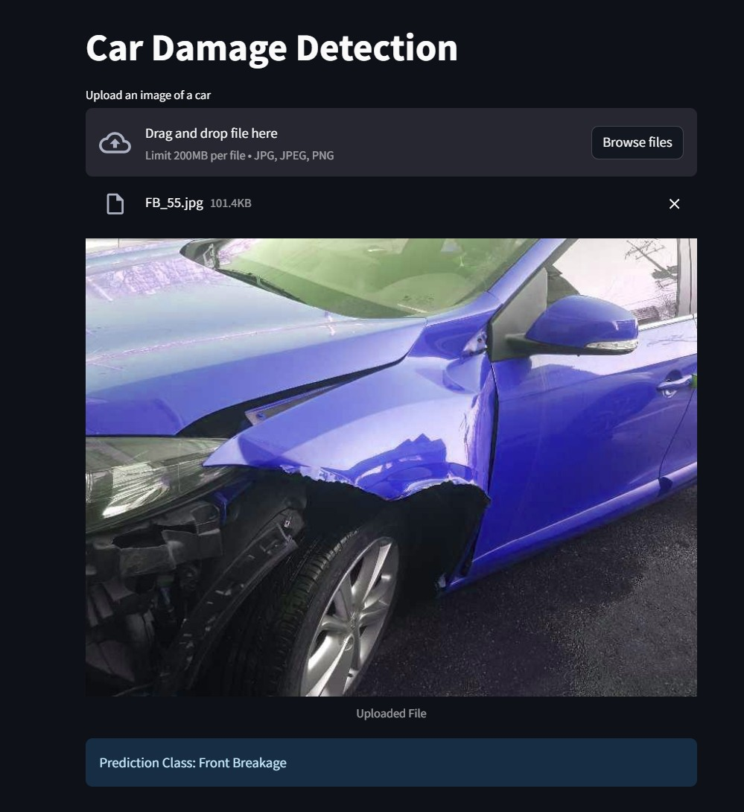

# Car Damage Prediction app
**This app let's you drag and drop an image of a car and it will tell you what kind of damage happend to the car. 
The model is trained on third quarter front and rare view hence the images are all in front and rare view only.**



### Model Details
1. Used ResNet50 for transfer learning 
2. Model was trained on around 1700 images with 6 target classes
   1. Front Normal
   1. Front Crushed
   1. Front Breakage
   1. Rear Normal
   1. Rear Crushed
   1. Rear Breakage
3. The accuracy on the validation set was around 80%

#### Set Up

1. To get started, first install the dependencies using:
    ``` commandline
    pip install -r requirements.txt
    
    ```
2. Run the streamlit app:
    ``` commandline
    streamlit run app/main.py
    
    ```


